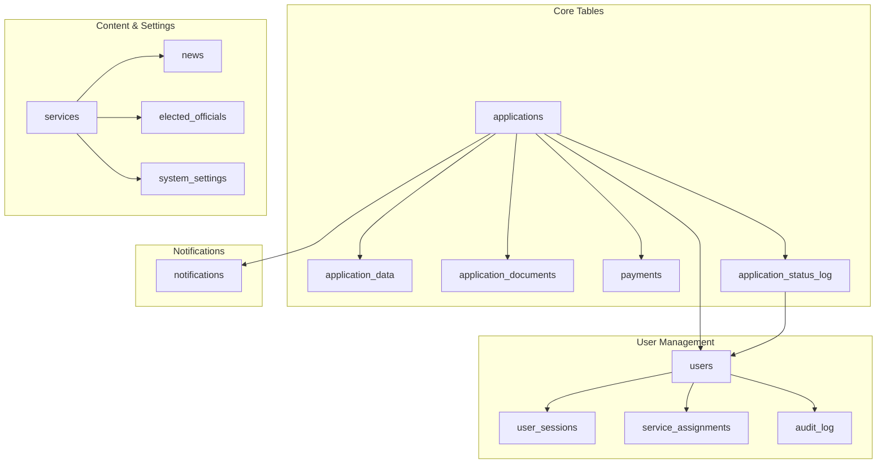
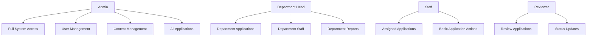
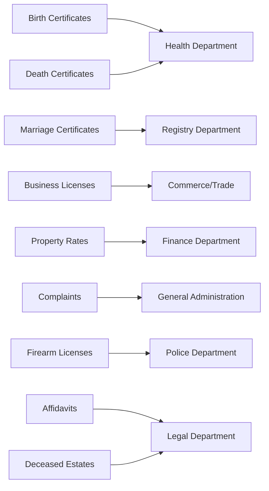
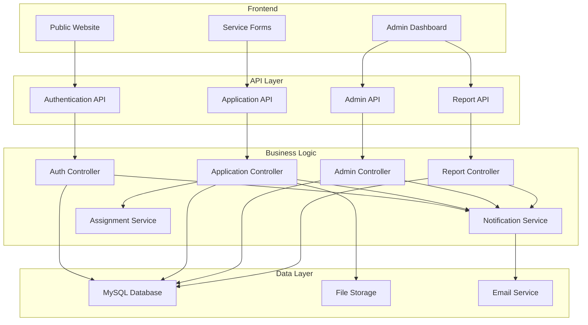
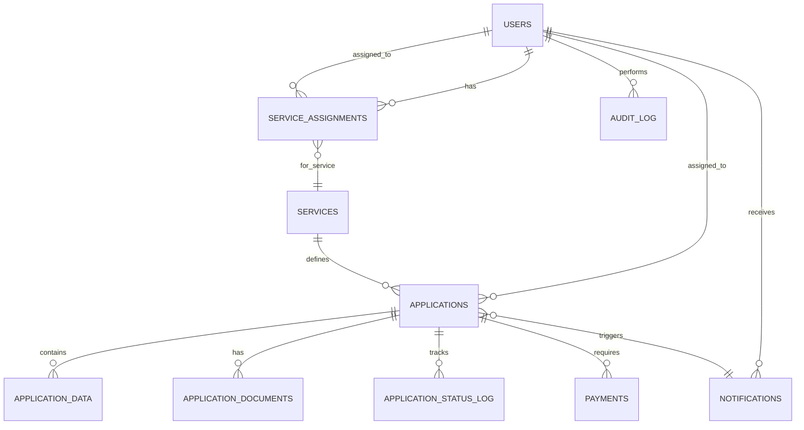
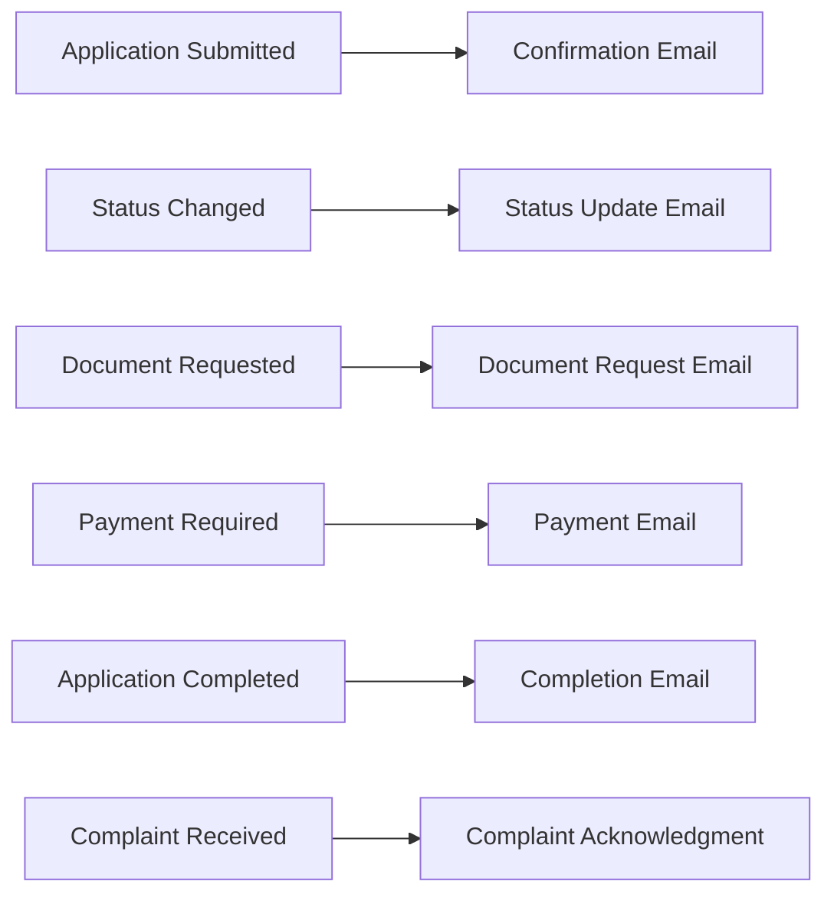

# Blantyre District Council - Backend Architecture

## Overview

This document outlines the comprehensive backend architecture for managing form submissions, user roles, and system administration for the Blantyre District Council website. The architecture is designed to handle the actual frontend forms and services currently implemented.

## Current System Analysis

### Existing Frontend Services
- **Birth Certificate** - Child information, parent details, hospital info
- **Death Certificate** - Deceased information, cause of death, informant details  
- **Marriage Certificate** - Couple information, marriage details, witnesses
- **Business License** - Business info, owner details, documents, payment
- **Property Rates** - Property information, owner details, payment periods
- **Complaint Reporting** - Category selection, complaint details, location
- **Firearm License** - Applicant info, firearm details, background check
- **Affidavits** - Document type, deponent information, affidavit content
- **Deceased Estates** - Estate information, executor details, asset inventory

### Existing Infrastructure
- **Framework**: CodeIgniter 4
- **Database**: MySQL (new schema created)
- **Current Models**: Basic ApplicationModel, ApplicationDocumentModel
- **Current Controllers**: ApplicationController (basic), Home, ContactUs

## Proposed Architecture

### 1. Database Schema Overview

The new unified schema handles all service types through a flexible application system:



### 2. Unified Application System

#### Database Schema

```sql
-- Main applications table - unified for all service types
CREATE TABLE `applications` (
    `id` INT(11) UNSIGNED NOT NULL AUTO_INCREMENT,
    `reference_number` VARCHAR(50) NOT NULL UNIQUE,
    `service_key` VARCHAR(100) NOT NULL,
    `status` ENUM('draft', 'submitted', 'under_review', 'approved', 'rejected', 'completed', 'cancelled') DEFAULT 'draft',
    `priority` ENUM('low', 'normal', 'high', 'urgent') DEFAULT 'normal',
    `assigned_to` INT(11) UNSIGNED NULL,
    `submitted_at` TIMESTAMP NULL,
    `review_started_at` TIMESTAMP NULL,
    `approved_at` TIMESTAMP NULL,
    `completed_at` TIMESTAMP NULL,
    `created_at` TIMESTAMP DEFAULT CURRENT_TIMESTAMP,
    `updated_at` TIMESTAMP DEFAULT CURRENT_TIMESTAMP ON UPDATE CURRENT_TIMESTAMP,
    PRIMARY KEY (`id`),
    FOREIGN KEY (`service_key`) REFERENCES `services`(`service_key`),
    FOREIGN KEY (`assigned_to`) REFERENCES `users`(`id`) ON DELETE SET NULL,
    INDEX `idx_reference` (`reference_number`),
    INDEX `idx_service` (`service_key`),
    INDEX `idx_status` (`status`),
    INDEX `idx_assigned_to` (`assigned_to`)
);

-- Flexible application data storage
CREATE TABLE `application_data` (
    `id` INT(11) UNSIGNED NOT NULL AUTO_INCREMENT,
    `application_id` INT(11) UNSIGNED NOT NULL,
    `data_type` VARCHAR(50) NOT NULL, -- 'applicant_info', 'service_specific', 'payment_info', etc.
    `data_key` VARCHAR(100) NOT NULL, -- field name
    `data_value` TEXT NULL, -- field value
    `created_at` TIMESTAMP DEFAULT CURRENT_TIMESTAMP,
    `updated_at` TIMESTAMP DEFAULT CURRENT_TIMESTAMP ON UPDATE CURRENT_TIMESTAMP,
    PRIMARY KEY (`id`),
    FOREIGN KEY (`application_id`) REFERENCES `applications`(`id`) ON DELETE CASCADE,
    INDEX `idx_application` (`application_id`),
    INDEX `idx_data_type` (`data_type`)
);
```

#### Service Configuration

```sql
-- Services table with actual frontend services
CREATE TABLE `services` (
    `id` INT(11) UNSIGNED NOT NULL AUTO_INCREMENT,
    `service_key` VARCHAR(100) NOT NULL UNIQUE,
    `service_name` VARCHAR(255) NOT NULL,
    `description` TEXT NULL,
    `department` VARCHAR(100) NOT NULL,
    `fee_amount` DECIMAL(10, 2) NOT NULL DEFAULT 0.00,
    `processing_days` INT(11) DEFAULT 5,
    `is_active` BOOLEAN DEFAULT TRUE,
    `sort_order` INT(11) DEFAULT 0,
    `created_at` TIMESTAMP DEFAULT CURRENT_TIMESTAMP,
    `updated_at` TIMESTAMP DEFAULT CURRENT_TIMESTAMP ON UPDATE CURRENT_TIMESTAMP,
    PRIMARY KEY (`id`),
    INDEX `idx_service_key` (`service_key`),
    INDEX `idx_department` (`department`)
);
```

### 3. User Management System

#### Database Schema

```sql
-- Users table for system access
CREATE TABLE `users` (
    `id` INT(11) UNSIGNED NOT NULL AUTO_INCREMENT,
    `username` VARCHAR(50) NOT NULL UNIQUE,
    `email` VARCHAR(255) NOT NULL UNIQUE,
    `password_hash` VARCHAR(255) NOT NULL,
    `full_name` VARCHAR(255) NOT NULL,
    `role` ENUM('admin', 'department_head', 'staff', 'reviewer') NOT NULL DEFAULT 'staff',
    `department` VARCHAR(100) NULL,
    `phone` VARCHAR(20) NULL,
    `is_active` BOOLEAN DEFAULT TRUE,
    `last_login` TIMESTAMP NULL,
    `created_at` TIMESTAMP DEFAULT CURRENT_TIMESTAMP,
    `updated_at` TIMESTAMP DEFAULT CURRENT_TIMESTAMP ON UPDATE CURRENT_TIMESTAMP,
    PRIMARY KEY (`id`),
    INDEX `idx_role` (`role`),
    INDEX `idx_department` (`department`),
    INDEX `idx_email` (`email`)
);

-- Service assignments to responsible users
CREATE TABLE `service_assignments` (
    `id` INT(11) UNSIGNED NOT NULL AUTO_INCREMENT,
    `service_key` VARCHAR(100) NOT NULL,
    `assigned_user_id` INT(11) UNSIGNED NOT NULL,
    `is_primary` BOOLEAN DEFAULT FALSE,
    `created_at` TIMESTAMP DEFAULT CURRENT_TIMESTAMP,
    `updated_at` TIMESTAMP DEFAULT CURRENT_TIMESTAMP ON UPDATE CURRENT_TIMESTAMP,
    PRIMARY KEY (`id`),
    FOREIGN KEY (`assigned_user_id`) REFERENCES `users`(`id`) ON DELETE CASCADE,
    FOREIGN KEY (`service_key`) REFERENCES `services`(`service_key`) ON DELETE CASCADE,
    INDEX `idx_service` (`service_key`),
    INDEX `idx_user` (`assigned_user_id`)
);
```

#### User Roles & Permissions



**Role Definitions:**

| Role | Permissions | Responsibilities |
|------|-------------|------------------|
| **Admin** | Full system access | User management, system configuration, all applications, content management |
| **Department Head** | Department-level access | Manage department staff, view all department applications, generate reports |
| **Staff** | Assigned applications only | Process assigned applications, update statuses, communicate with applicants |
| **Reviewer** | Review permissions | Review applications, approve/reject, add notes |

### 2. Service-to-Department Mapping



**Department Assignments:**

| Service Key | Service Name | Responsible Department | Fee (MWK) | Processing Days |
|-------------|--------------|---------------------|-----------|-----------------|
| birth_certificate | Birth Certificate | Health | 5,000 | 5 |
| death_certificate | Death Certificate | Health | 3,000 | 3 |
| marriage_certificate | Marriage Certificate | Registry | 10,000 | 7 |
| business_license | Business License | Commerce/Trade | 25,000 | 10 |
| property_rates | Property Rates | Finance | Variable | 2 |
| complaint_reporting | Complaint Reporting | General | 0 | 3 |
| firearm_license | Firearm License | Police | 15,000 | 14 |
| affidavits | Affidavits | Legal | 2,000 | 2 |
| deceased_estates | Deceased Estates | Legal | 5,000 | 10 |

### 4. Enhanced Application Workflow

```mermaid
stateDiagram-v2
    [*] --> Draft
    Draft --> Submitted: Submit Form
    Submitted --> Under Review: Auto-assign
    Under Review --> Approved: Approve
    Under Review --> Rejected: Reject
    Under Review --> More Info: Request Documents
    More Info --> Under Review: Documents Provided
    Approved --> Payment Required: Payment Needed
    Payment Required --> Completed: Payment Confirmed
    Rejected --> [*]
    Completed --> [*]
    
    note right of Under Review: Department staff review
    note right of Approved: Ready for payment
    note right of Completed: Service delivered
```

### 5. System Architecture Overview



### 6. API Endpoints Structure

#### Authentication Endpoints
```
POST   /api/auth/login              - User login
POST   /api/auth/logout             - User logout
POST   /api/auth/refresh            - Refresh token
GET    /api/auth/profile           - Get user profile
PUT    /api/auth/profile           - Update profile
POST   /api/auth/forgot-password    - Forgot password
POST   /api/auth/reset-password     - Reset password
```

#### Application Management
```
GET    /api/applications           - List applications (filtered)
POST   /api/applications/submit    - Submit new application
GET    /api/applications/:id        - Get application details
PUT    /api/applications/:id        - Update application
DELETE /api/applications/:id        - Delete application
POST   /api/applications/:id/documents - Upload document
GET    /api/applications/:id/data   - Get application data
PUT    /api/applications/:id/data   - Update application data
```

#### Admin Endpoints
```
GET    /api/admin/applications    - All applications with filters
PUT    /api/admin/applications/:id/assign    - Assign to user
PUT    /api/admin/applications/:id/status   - Update status
GET    /api/admin/users           - User management
POST   /api/admin/users           - Create user
PUT    /api/admin/users/:id       - Update user
DELETE /api/admin/users/:id       - Delete user
GET    /api/admin/reports         - Generate reports
GET    /api/admin/dashboard        - Dashboard data
GET    /api/admin/services        - Service management
PUT    /api/admin/services/:key   - Update service
GET    /api/applications/my        - User's applications
```

### 7. Database Relationships



### 8. Form Data Structure Examples

#### Birth Certificate Application Data
```json
{
  "applicant_info": {
    "full_name": "John Doe",
    "email": "john@example.com",
    "phone": "+265999123456",
    "id_number": "123456789",
    "relationship": "father"
  },
  "child_info": {
    "child_name": "Baby Doe",
    "date_of_birth": "2024-01-15",
    "place_of_birth": "Queen Elizabeth Central Hospital",
    "gender": "female"
  },
  "parent_info": {
    "mother_name": "Jane Doe",
    "mother_id": "987654321",
    "father_name": "John Doe",
    "father_id": "123456789"
  }
}
```

#### Business License Application Data
```json
{
  "business_info": {
    "business_name": "Doe Enterprises",
    "business_type": "retail",
    "business_address": "123 Main St, Blantyre",
    "registration_number": "BN123456"
  },
  "owner_info": {
    "owner_name": "John Doe",
    "owner_email": "john@doeenterprises.com",
    "owner_phone": "+265999123456",
    "owner_id": "123456789"
  },
  "payment_info": {
    "license_type": "commercial",
    "payment_period": "annual",
    "amount": 25000
  }
}
```

### 9. Implementation Phases

#### Phase 1: Database Setup & Authentication (Week 1-2)
**Priority: High**

**Tasks:**
- Deploy new database schema
- Create user management models
- Implement authentication middleware
- Build login/logout functionality
- Create role-based access control
- Add session management

**Files to Create:**
```
app/Database/migrations/002_new_complete_schema.sql (DONE)
app/Controllers/AuthController.php
app/Models/UserModel.php
app/Models/ServiceModel.php
app/Models/ApplicationModel.php (enhanced)
app/Models/ApplicationDataModel.php
app/Filters/AuthFilter.php
app/Views/auth/login.php
app/Views/auth/dashboard.php
```

#### Phase 2: Enhanced Application Processing (Week 3-4)
**Priority: High**

**Tasks:**
- Implement unified application submission
- Add auto-assignment logic
- Create flexible data storage
- Add workflow status management
- Create notification system
- Enhance document handling

**Files to Update/Create:**
```
app/Controllers/ApplicationController.php (rewrite)
app/Services/NotificationService.php
app/Services/AssignmentService.php
app/Services/FormProcessorService.php
app/Models/NotificationModel.php
app/Models/PaymentModel.php
```

#### Phase 3: Admin Dashboard (Week 5-6)
**Priority: Medium**

**Tasks:**
- Build admin dashboard interface
- Create user management UI
- Add application management interface
- Implement reporting features
- Add content management
- Create service configuration UI

**Files to Create:**
```
app/Controllers/AdminController.php
app/Controllers/UserController.php
app/Controllers/ReportController.php
app/Views/admin/dashboard.php
app/Views/admin/users.php
app/Views/admin/applications.php
app/Views/admin/reports.php
app/Views/admin/services.php
```

#### Phase 4: Advanced Features (Week 7-8)
**Priority: Low**

**Tasks:**
- Add analytics and reporting
- Implement bulk operations
- Add API documentation
- Performance optimization
- Security hardening

### 10. Security Considerations

#### Authentication Security
- **Password Hashing**: Use bcrypt/Argon2
- **Session Management**: Secure token-based sessions
- **Rate Limiting**: Prevent brute force attacks
- **Two-Factor Auth**: Optional 2FA for admins

#### Data Protection
- **Input Validation**: Sanitize all inputs
- **SQL Injection Prevention**: Use prepared statements
- **XSS Protection**: Output escaping
- **CSRF Protection**: Token validation

#### Access Control
- **Role-Based Permissions**: Enforce at controller level
- **Department Restrictions**: Limit data access
- **Audit Logging**: Track all user actions
- **IP Whitelisting**: Admin access restrictions

### 11. Notification System

#### Email Notifications


**Email Templates:**
- Application submission confirmation
- Status change notifications
- Document request notifications
- Payment reminders
- Completion notifications
- Complaint acknowledgment

#### In-App Notifications
- Real-time updates for staff
- Task assignments
- Deadline reminders
- System announcements

### 12. Reporting & Analytics

#### Dashboard Metrics
- Application volume by service type
- Processing time analytics
- User performance metrics
- Revenue tracking
- Department workload analysis

#### Report Types
- Daily/weekly/monthly summaries
- Department performance reports
- User activity reports
- Financial reports
- Custom date range reports

### 13. File Structure

```
app/
├── Controllers/
│   ├── AuthController.php
│   ├── AdminController.php
│   ├── UserController.php
│   ├── ReportController.php
│   └── ApplicationController.php (rewrite)
├── Models/
│   ├── UserModel.php
│   ├── ServiceModel.php
│   ├── ApplicationModel.php (enhanced)
│   ├── ApplicationDataModel.php
│   ├── NotificationModel.php
│   ├── PaymentModel.php
│   └── AuditLogModel.php
├── Services/
│   ├── AuthService.php
│   ├── NotificationService.php
│   ├── AssignmentService.php
│   ├── FormProcessorService.php
│   └── ReportService.php
├── Filters/
│   ├── AuthFilter.php
│   ├── AdminFilter.php
│   └── RoleFilter.php
├── Views/
│   ├── auth/
│   │   ├── login.php
│   │   └── dashboard.php
│   ├── admin/
│   │   ├── dashboard.php
│   │   ├── users.php
│   │   ├── applications.php
│   │   ├── reports.php
│   │   └── services.php
│   └── emails/
│       ├── application_submitted.php
│       ├── status_updated.php
│       ├── payment_required.php
│       └── complaint_acknowledgment.php
└── Libraries/
    ├── PermissionManager.php
    ├── NotificationManager.php
    └── FormProcessor.php
```

### 14. Configuration

#### Service Configuration
```json
{
  "services": {
    "birth_certificate": {
      "name": "Birth Certificate",
      "department": "health",
      "fee": 5000,
      "processing_days": 5,
      "required_documents": ["birth_notification", "parent_id", "application_form"],
      "auto_assign_to": "health_department_head"
    },
    "business_license": {
      "name": "Business License",
      "department": "commerce",
      "fee": 25000,
      "processing_days": 10,
      "required_documents": ["business_plan", "id_card", "tax_clearance"],
      "auto_assign_to": "commerce_department_head"
    }
  }
}
```

#### Email Configuration
```php
// app/Config/Email.php
public $fromEmail = 'noreply@blantyredc.gov.mw';
public $fromName = 'Blantyre District Council';
public $smtpHost = 'smtp.blantyredc.gov.mw';
public $smtpPort = 587;
```

## Next Steps

### Immediate Actions (This Week)
1. **Set up development environment**
2. **Create user management tables**
3. **Implement basic authentication**
4. **Build admin login interface**

### Short Term (2-4 Weeks)
1. **Complete authentication system**
2. **Implement application assignment logic**
3. **Build admin dashboard**
4. **Add notification system**

### Medium Term (1-2 Months)
1. **Full admin interface**
2. **Advanced reporting**
3. **Mobile responsiveness**
4. **Performance optimization**

### Long Term (3-6 Months)
1. **Advanced analytics**
2. **Integration with payment gateways**
3. **Mobile app API**
4. **AI-powered automation**

---

## Conclusion

This updated architecture provides a robust, scalable, and secure backend system that directly reflects the actual frontend forms and services currently implemented. The unified application system with flexible data storage allows for easy addition of new services while maintaining consistent processing workflows.

The modular design allows for incremental implementation and future enhancements while maintaining security and performance standards. The system will enable efficient processing of citizen applications, proper delegation of responsibilities, and comprehensive administrative oversight while maintaining transparency and accountability throughout the process.
