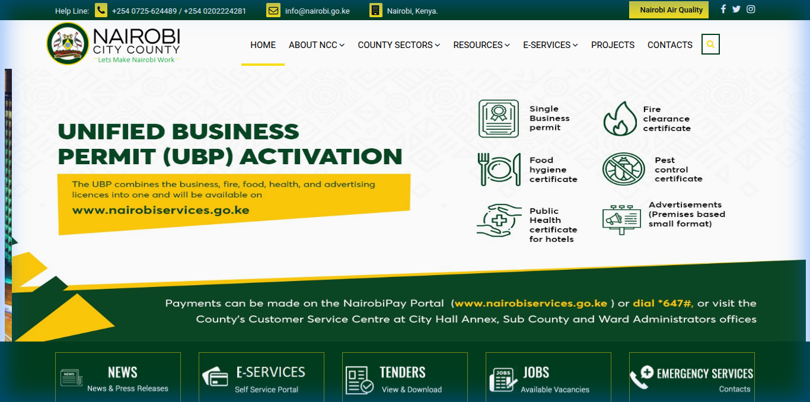
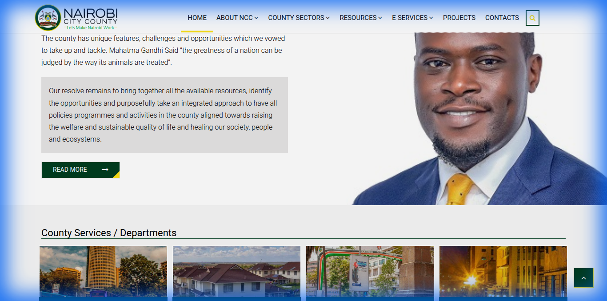
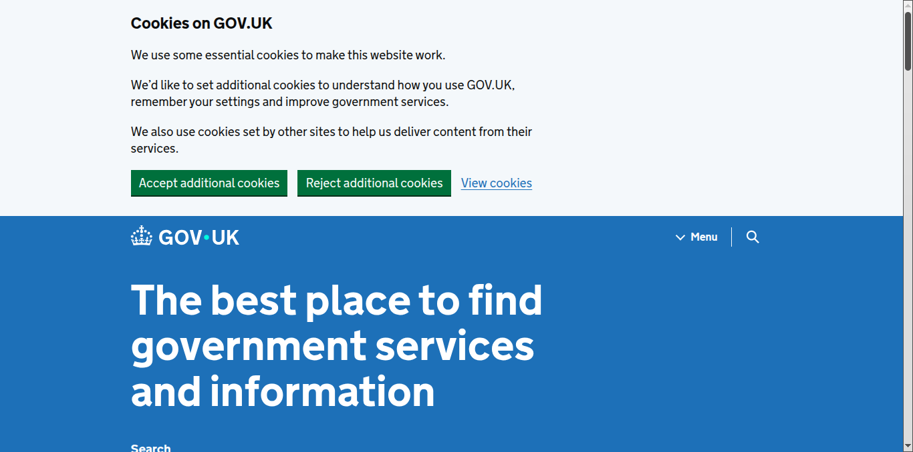
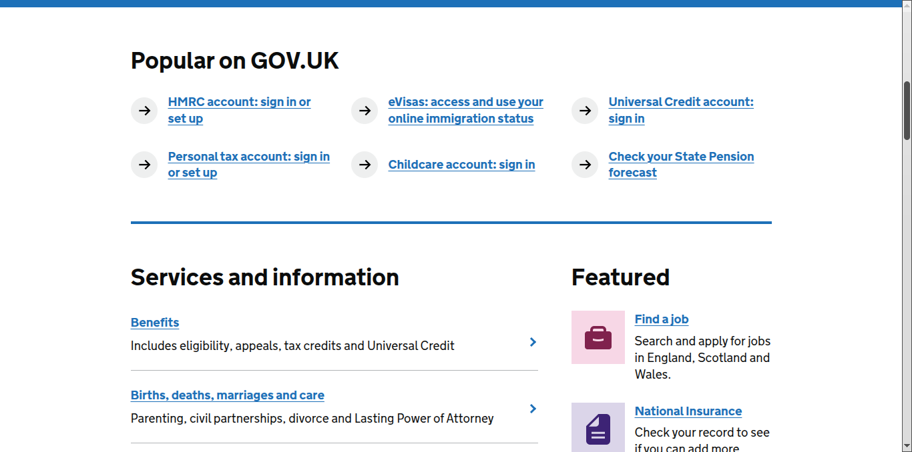
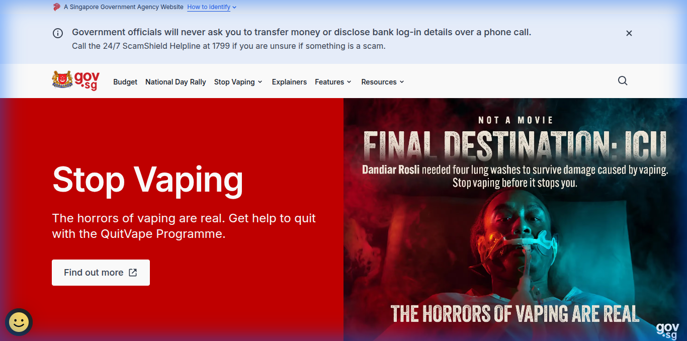
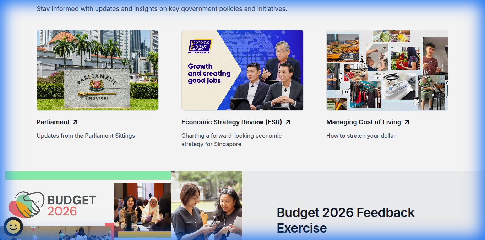
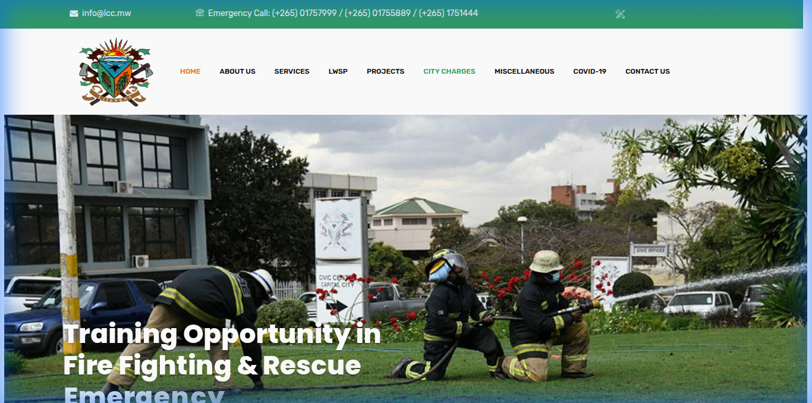
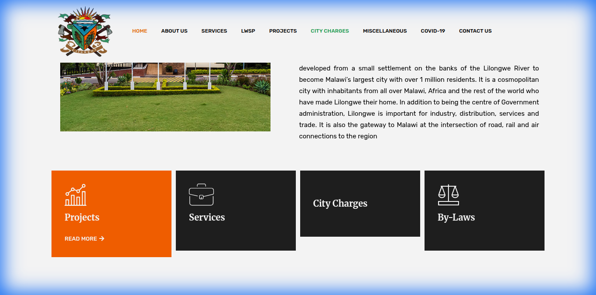

# Proposal: Transforming Blantyre District Council into a Digital Leader

**Date:** 2026-02-10
**Prepared For:** Blantyre District Council Development Team
**Objective:** To benchmark global and regional leaders in e-governance and propose a roadmap to make the Blantyre District Council website "100x Better."

---

## 1. Executive Summary

The current Blantyre District Council website is functional but operates primarily as an "Online Brochure." It informs citizens but does not empower them. 

Our research into **Nairobi City County**, **GOV.UK**, **Singapore**, and **Lilongwe City Council** reveals a shift towards **Service-First Architecture**. Modern government sites are not about "Who We Are" but "What You Can Do."

This proposal outlines a strategy to leapfrog our competitors by adopting a **Citizen-Centric, Transactional, and Trust-Based** design, powered by modern tech stacks.

---

## 2. Competitive Benchmarking & Analysis

We analyzed four distinct tiers of government websites to identify gaps and opportunities.

### A. The African Tech Leader: Nairobi City County
**The Strategy:** "Do It Now."
Nairobi does not bury services. The Hero section is a direct Call-to-Action for payments and permits.

**What We Observed:**
- **Unified Payment Portal:** "NairobiPay" is front and center.
- **Direct Action Hero:** The banner isn't just a picture; it's a prompt to pay parking fees or get a license.

| Hero Section | Service Integration |
| :---: | :---: |
|  |  |

**The Lesson for Blantyre:** We need a "BlantyrePay" or "Quick Actions" bar immediately visible on load.

---

### B. The Global Gold Standard: GOV.UK
**The Strategy:** "Radical Simplicity."
GOV.UK assumes users are in a hurry. There are no carousels, no welcoming speeches—just a massive search bar and clear categories.

**What We Observed:**
- **Search-First Design:** Acknowledges that search is faster than navigation.
- **Life-Event Categorization:** Services are grouped by "Births," "Deaths," "Business," not by "Directorate of X."

| Search Dominance | Life Event Categories |
| :---: | :---: |
|  |  |

**The Lesson for Blantyre:** We must categorize our menu by **User Intent** (e.g., "I want to apply for...") rather than **Organizational Chart**.

---

### C. The High-Tech Innovator: Singapore (GOV.SG)
**The Strategy:** "Trust & Engagement."
Singapore treats citizens as partners. They focus on building trust and gathering feedback.

**What We Observed:**
- **The Trust Bar:** A simple top banner confirming "A Singapore Government Agency Website."
- **Campaign Focus:** High-quality visuals for national initiatives (e.g., Health, Budget).

| Trust & Visuals | Citizen Engagement |
| :---: | :---: |
|  |  |

**The Lesson for Blantyre:** We need a standardized "Official Government" header to prevent phishing and build authority.

---

### D. The Local Competitor: Lilongwe City Council
**The Strategy:** "Information Portal."
Functional, but traditional. It lists services but lacks the interactivity of Nairobi.

| Traditional Layout | Service Lists |
| :---: | :---: |
|  |  |

**The Gap:** Blantyre can easily surpass this by moving from "Listing Services" to "Performing Services."

---

## 3. The Vision: How We Make Blantyre 100x Better

To lead, we don't just copy; we innovate. Here is the feature set that will define the new platform.

### Pillar 1: "Blantyre Connect" (Unified Citizen Dashboard)
Instead of disjointed forms, we create a single login (**Blantyre ID**).
- **Current:** Download a PDF, print it, walk to the office.
- **Future:** Login, click "Apply for Permit," track status in real-time on your dashboard.
- **Inspiration:** NairobiPay, UK Universal Credit.

### Pillar 2: AI-Powered "Ask Blantyre"
Most citizens don't know which directorate handles "Noise Complaints."
- **Feature:** An AI Chatbot trained on all council by-laws and procedures.
- **User Query:** "My neighbor is burning trash, what do I do?"
- **AI Answer:** "That falls under Environmental Health. You can report it anonymously right here: [Link]."
- **Tech:** RAG (Retrieval-Augmented Generation) on our internal documents.

### Pillar 3: Real-Time District Map (Transparency Engine)
Show citizens where their tax money goes.
- **Feature:** An interactive Mapbox/Google Maps layer.
- **Data:** Pins showing "Road Graded (Yesterday)," "New Clinic Construction (In Progress)," "Market Stalls Available."
- **Why:** Builds massive trust and engagement.

### Pillar 4: Meaningful Mobile-First Design
70%+ of our traffic will be mobile.
- **Feature:** WhatsApp Integration for alerts and simple queries.
- **Feature:** "Lite Mode" for low-bandwidth areas (automatic image compression).

### Pillar 5: Multi-Language Support (Inclusivity)
Government services must be accessible to everyone, not just English speakers.
- **Problem:** The current site lacks support for local languages.
- **Solution:** Implement a top-bar Toggle for **English / Chichewa**.
- **Tech:** AI-assisted translation for static content to ensure accurate communication of council by-laws and announcements.

## 4. Implementation Roadmap

### Phase 1: Comparison & Cleanup (Done)
- [x] Analyze competitors.
- [x] Fix current asset paths and server errors.

### Phase 2: The Foundation (Next 2 Weeks)
- [ ] Implement the **"Trust Bar"** (Singapore style).
- [ ] Rebuild the **Navigation Menu** based on User Intent (Business, Resident, Visitor) instead of Departments.
- [ ] Implement **"Search-First"** hero section option.

### Phase 3: The Digital Transformation (Month 1-2)
- [ ] Build **Service Cards** (Action-oriented UI components).
- [ ] Prototype the **Blantyre Connect** login flow.
- [ ] Integrate a **Feedback Widget** on every page ("Was this helpful?").

### Phase 4: Innovation (Month 3+)
- [ ] AI Chatbot integration.
- [ ] Real-time mapping module.

## 6. Visual Language & Experience: The "Ultra-Modern" Redesign

To ensure the website doesn't just *work* better but *feels* world-class, we will adopt a **"Malawian Modernism"** aesthetic. This combines local identity with Silicon Valley design trends.

### A. Dynamic Layouts (The "Bento" Grid)
Standard government sites use boring lists. We will use **Bento Grids** (popularized by Apple and Linear) for our service menu.
- **Concept:** Services are displayed in a responsive, masonry-style grid of cards.
- **Why:** It breaks monotony and allows us to highlight key services (like "Pay Rates") with larger, bolder cards while keeping lesser-used ones smaller.

### B. Glassmorphism & Depth
We will ditch flat, boring colors for **Glassmorphism**.
- **Usage:** Overlays for modals (e.g., "Login to Blantyre Connect") and sticky navigation bars.
- **Effect:** A frosted-glass blur over the background creates a sense of depth and hierarchy, making the active content pop.

### C. Motion Design & Micro-interactions
A static site feels dead. We will implement **Purposeful Motion**:
- **Scroll-Driven Animations:** As citizens scroll down the "Distict Map," elements fade in and slide up smoothly.
- **Hover Effects:** Service cards shouldn't just change color; they should lift up (scale: 1.05) and cast a softer shadow to invite clicking.
- **Loading States:** Instead of a spinning circle, use a **Skeleton Loader** that shimmers, making the site feel faster.

### D. Typography & White Space
- **Typeface:** Switch to a geometric sans-serif (e.g., *Inter* or *Plus Jakarta Sans*) for high readability and a tech-forward look.
- **Breathing Room:** Increase padding by 50%. Modern luxury is defined by white space. Don't cram content; let it breathe.

### E. Dark Mode Support
- A toggle for "Night Mode" isn't just cool; it's necessary for accessibility and battery saving. The interface will automatically adapt to a high-contrast dark theme.

## 7. Conclusion
We have the opportunity to build not just a website, but a **Digital Council**. By stealing the "Trust" from Singapore, the "Speed" from Nairobi, and the "Simplicity" from the UK, and wrapping it in an **Ultra-Modern Visual Identity**, Blantyre District Council will set the new standard for governance in Malawi and beyond.
